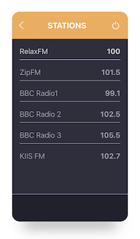
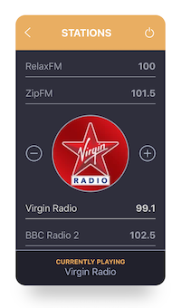

# Jukebox 

Simple implementation of Radio player UI.

 

## 🎯 Purpose 
A quick prototype using React. Mainly focused on accessibility, keyboard navigation, long radio station name support and component tests.

Rewriten in typescript here: [in-typescript](https://github.com/hellopovi/jukebox/tree/in-typescript)
